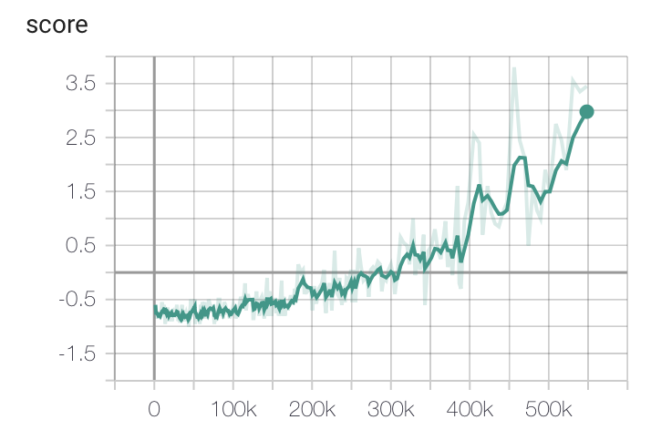
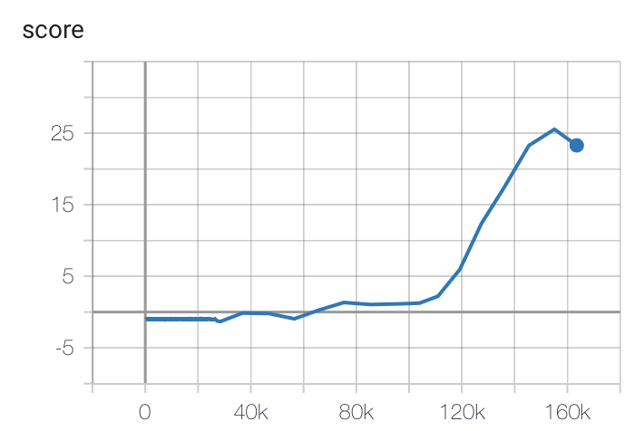

# RL Algorithms

# TODO
 - [x] load, save model
 - [x] write with tensorboard
 - [x] torch device 
 - [x] change cfg format

# Install
  
```
 $ git clone https://github.kakaocorp.com/leonard-q/RL_Algorithms.git  
 $ pip install -r requirements.txt  
 $ python main.py 
```

# Release Note
## v 0.0.1
    ADD DQN algorithm
    ADD SAC algorithme
    ADD CartPole environment
    ADD Pendulum environment

# Results

## Pong (DQN)

  

## BreakOut (DQN)

  

## Hopper (SAC)

  