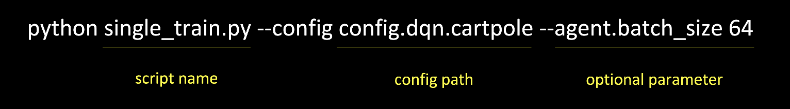

# JORLDY 

[](LICENSE)

**Join Our Reinforcement Learning framework for Developing Yours (JORLDY)** is an open-source Reinforcement Learning (RL) framework provided by [KakaoEnterpise](https://www.kakaoenterprise.com/). It provides various RL algorithms and environment and they can be easily used using single code. This repository is opened for helping RL researchers and students who study RL.


## :fire: Features

- 20+ RL Algorithms and various RL environment are provided
- Algorithms and environment are customizable
- New algorithms are environment can be added 
- Distributed RL algorithms are provided using [ray](https://github.com/ray-project/ray)
- Benchmark of the algorithms is conducted in many RL environment


## :arrow_down: Installation

```
 $ git clone https://github.com/kakaoenterprise/jorldy.git  
 $ cd jorldy
 $ pip install -r requirements.txt  
```


## :rocket: QuickStart

 


## :card_index_dividers: Release 

| Version |   Release Date   |   Source   |   Download   |
| :-----: | :--------------: | :--------: | :----------: |
|  1.0.0  | October xx, 2021 | [Source]() | [Download]() |


## :page_facing_up: Documentation

- [Implementation List](https://github.kakaocorp.com/leonard-q/RL_Algorithms/blob/master/docs/Implementation_list.md)
- [Benchmark](https://github.kakaocorp.com/leonard-q/RL_Algorithms/blob/master/docs/Benchmark.md)
- [Distributed Architecture](https://github.kakaocorp.com/leonard-q/RL_Algorithms/blob/master/docs/Distributed_Architecture.md)
- [Reference](https://github.kakaocorp.com/leonard-q/RL_Algorithms/blob/master/docs/Reference.md)


- [How to use](https://github.kakaocorp.com/leonard-q/RL_Algorithms/blob/master/docs/How_to_use.md)
- [How to add RL algorithm](https://github.kakaocorp.com/leonard-q/RL_Algorithms/blob/master/docs/How_to_add_rl_algorithm.md)
- [How to add environment](https://github.kakaocorp.com/leonard-q/RL_Algorithms/blob/master/docs/How_to_add_environment.md)
- [How to add network](https://github.kakaocorp.com/leonard-q/RL_Algorithms/blob/master/docs/How_to_add_network.md)

## :busts_in_silhouette: Contributors

 


## :copyright: License

[Apache License 2.0]()


