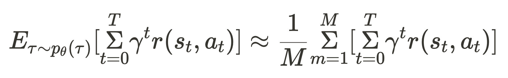
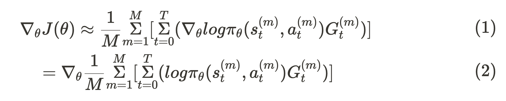
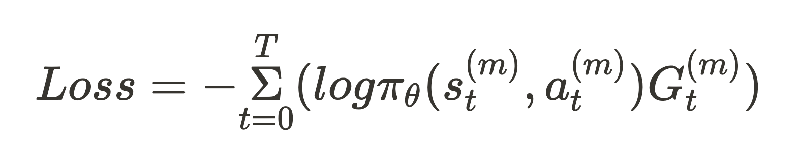
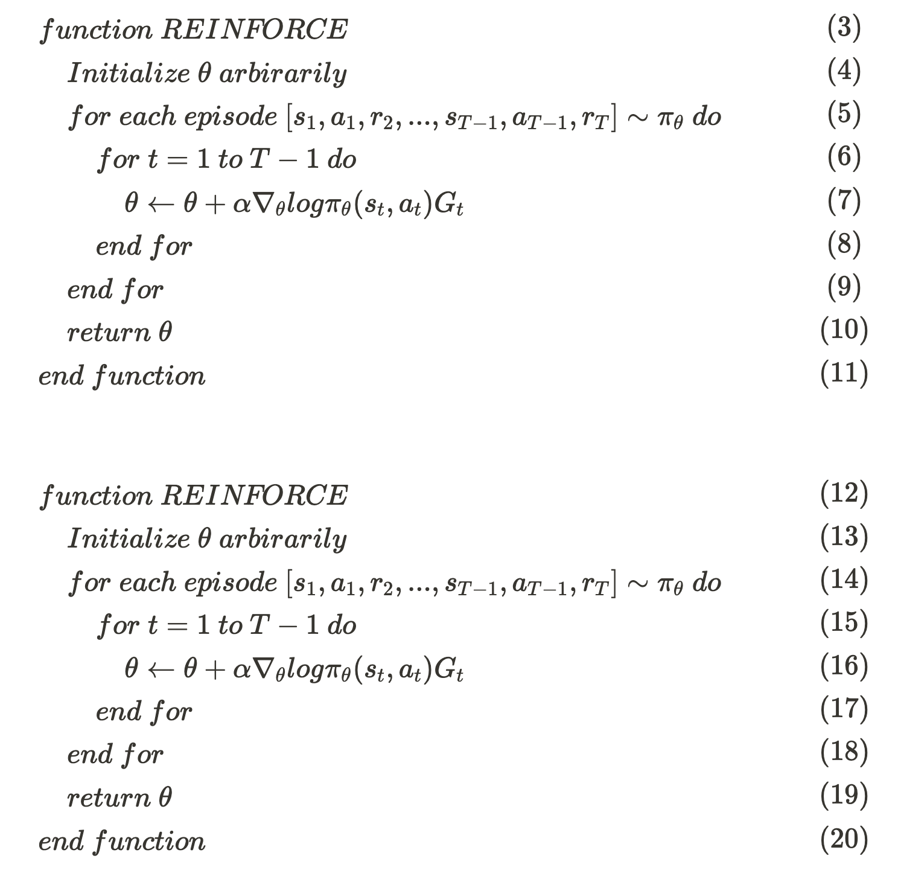

# REINFORCE

Paper Link: [https://people.cs.umass.edu/~barto/courses/cs687/williams92simple.pdf](https://people.cs.umass.edu/~barto/courses/cs687/williams92simple.pdf)

## Key Features

- REINFORCE = MonteCarlo Policy Gradient Method
- Sample derived from REINFORCE has high variance
- REINFORCE is On-Policy Method

## Background

### MonteCarlo Policy Gradient Method

In applying the Policy Gradient, there is a problem that the expected value of return actually cannot be calculated directly. Therefore, REINFORCE algorithm use a method of extracting samples in units of episodes to estimate expected value of return and strengthening policies based on these estimates . The following shows the objective function of REINFORCE. 

 

Based on the above equation, the gradient of the objective function can be estimated approximately as follows.

 

## Method

### Loss Function of REINFORCE

The episode loss function is configured the policy  represented by . The Loss is as follows.

 

This is an inversion of the derivative of the objective function. This expresses the inversely proportional nature of the loss decreasing as the value of the objective function expressed as the expectation of the Return  value increases.

It can be seen that this is a form obtained by multiplying the return for the cross-entropy equation in which the ratio of target is always 1. Therefore, as the size of the  increases, it affects the  more, and as the size of the  decreases, it affects the  less.


## Algorithm

 

### limitations

- **REINFORCE updates $\pi$ based on sample of episode unit** <br>
In case of long episodes, neural network training time is prolonged.
- **The variance of REINFORCE’s learning gradient is large** <br>
Due to the large variance of the $G$ depending on the length of episode, neural network learning may be unstable overall and the training time may be longer.
- **REINFORCE algorithm is On-Policy algorithm** <br>
Since REINFORCE is On-Policy algorithm, which executes $\pi$ to collect samples and updates based on the obtained samples, bias occurs in samples. In addition, since the number of sample used for learning is small, data efficiency is poor.


## Implementation on JORLDY

- [REINFORCE JORLDY Implementation](https://github.com/kakaoenterprise/JORLDY/blob/master/jorldy/core/agent/reinforce.py)

```python
### learning process function ###
# 1. save transition
# 2. learn
# 3. learning rate decay

def process(self, transitions, step):
        result = {}
        # Process per step
        self.memory.store(transitions)

        # Process per epi
        if transitions[0]["done"]:
            result = self.learn()
						self.learning_rate_decay(step)

        return result
```

```python
### learn function ###
# 1. extract transitions
# 2. calculate loss
# 3. update
# 4. return result

def learn(self):
        transitions = self.memory.sample()

        state = transitions["state"]
        action = transitions["action"]
        reward = transitions["reward"]

        ret = np.copy(reward)
        for t in reversed(range(len(ret) - 1)):
            ret[t] += self.gamma * ret[t + 1]
        if self.use_standardization:
            ret = (ret - ret.mean()) / (ret.std() + 1e-7)

        state, action, ret = map(lambda x: self.as_tensor(x), [state, action, ret])

        if self.action_type == "continuous":
            mu, std = self.network(state)
            m = Normal(mu, std)
            z = torch.atanh(torch.clamp(action, -1 + 1e-7, 1 - 1e-7))
            log_prob = m.log_prob(z)
        else:
            pi = self.network(state)
            log_prob = torch.log(pi.gather(1, action.long()))
        loss = -(log_prob * ret).mean()

        self.optimizer.zero_grad(set_to_none=True)
        loss.backward()
        self.optimizer.step()

        result = {"loss": loss.item()}
        return result
```

# References

### Relevant papers

- [Policy Gradient Methods For Reinforcement Learning With Approximation](https://proceedings.neurips.cc/paper/1999/file/464d828b85b0bed98e80ade0a5c43b0f-Paper.pdf)
(R. S. Sutton et al, 1999)