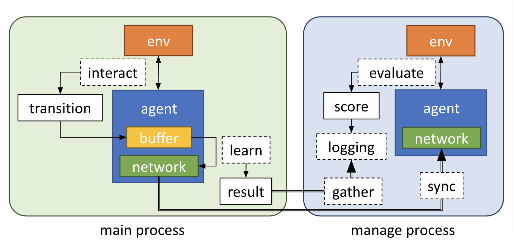
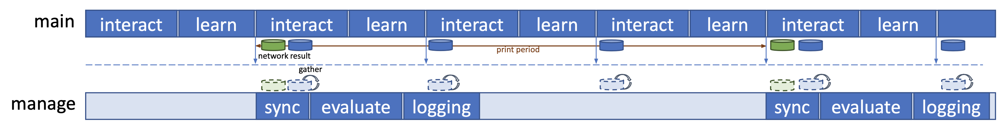
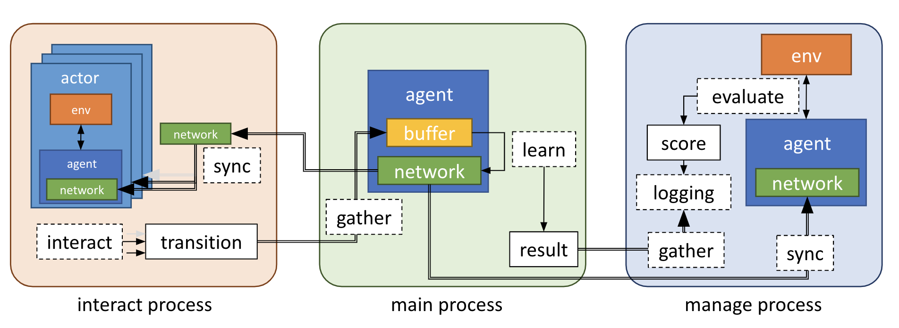
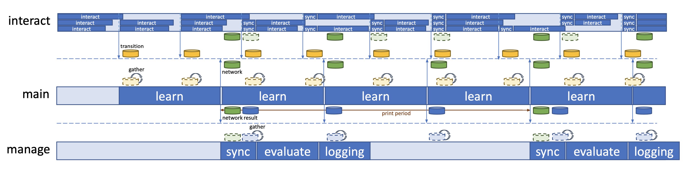

# Distributed Architecture

In addition to single actor train, it supports distributed reinforcement learning (synchronous and asynchronous both). To implement distributed reinforcement learning, we use __ray__(In particular, to allow actors to interact in parallel) and __multiprocessing__. See the flowchart and timeline for each script(single, sync and async). Flowchart shows the flow of data between processes between components. Timeline shows the work progress and data communication between processes.

## Single actor train

In a single actor train script, there is __main process__ and __manage process__. In the __main process__, a single agent interacts with env to collect transition data and trains network from it. In the __manage process__, evaluates with the latest network to get a score, and records this score and the results of training in the main process.

### Flow chart
 

### Timeline
 

## Sync distributed train

Sync distributed train script also has __main process__ and __manage process__. In the __main process__, multiple actors interact in parallel at the same time to collect transition data and learner trains model from it. In the __manage process__, evaluates with the latest model to get a score, and records this score and the results of training in the main process.

### Flow chart
 

### Timeline
 

## Async distributed train

Async distributed train script has __interact process__, __main process__ and __manage process__. In the __interact process__, multiple actors interact in parallel to collect transition data. Unlike the sync distributed train script, each actor interacts asynchronously. More specifically, in the async distributed train script, when actors interact, data is transferred only for actors that have completed within a specific time. In the __main process__, the learner trains the model through the transition data. In the __manage process__, evaluates with the latest model to get a score, and records this score and the results of training in the main process.

### Flow chart
 

### Timeline
 

reference: [manager/distributed_manager.py](../manager/distributed_manager.py), [process](../process.py)
